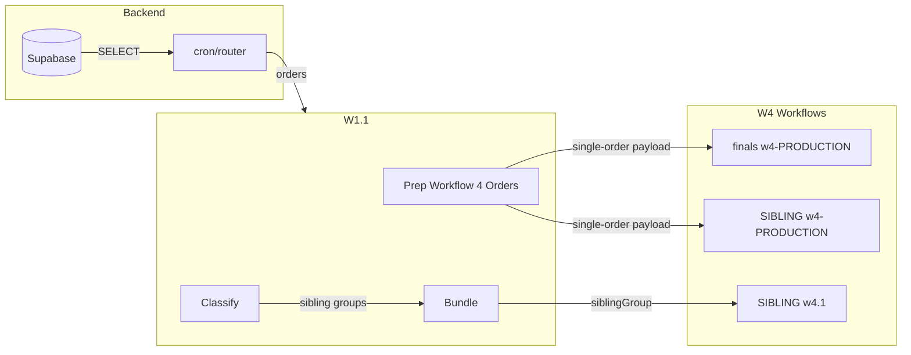

# D2C Shipping Tier to Lulu — Implementation Plan

## Problem
D2C checkout saves `shipping_tier` (mail, ground_home, priority_mail, expedited, express) on orders, but it does not reach W4/W4.1 or get passed to Lulu. The cron router omits it from the SELECT, W1.1 Prep does not include it in the payload, and the w4.1 Aggregate node ignores it and uses only the CONFIG default.

## Data Flow



**Gaps:**
1. Cron SELECT omits `shipping_tier`
2. Prep Workflow 4 Orders omits `shipping_tier` from its output
3. w4.1 Aggregate node reads only `CONFIG.defaults.shippingLevel` and has incorrect `normalizeShippingLevel` mapping

---

## D2C to Lulu Mapping (Canonical)

| D2C Tier | Lulu Enum |
|----------|-----------|
| mail | MAIL |
| ground_home | GROUND_HD |
| priority_mail | PRIORITY_MAIL |
| expedited | EXPEDITED |
| express | EXPRESS |

---

## Implementation

### 1. Cron Router — Add `shipping_tier` to SELECT

**File:** [back-end/src/app/api/cron/router/route.ts](back-end/src/app/api/cron/router/route.ts)

**Location:** Line ~428, the orders SELECT.

**Change:** Add `shipping_tier` to the select list:

```ts
.select('id,"orderId",amazon_order_id,character_hash,next_workflow,dedication_text,one_manifest_url,character_specs,execution_status,priority,queued_at,updated_at,shipping_address,lulu_status,lulu_job_id,customer_approval_required,customer_approval_status,amazon_shipment_service_level,shipping_tier')
```

---

### 2. W1.1 Prep Workflow 4 Orders — Pass `shipping_tier` Through

**Files:**
- [docs/n8n-workflow-files/finals/w1.1-Queue_Manager_and_Router.json](docs/n8n-workflow-files/finals/w1.1-Queue_Manager_and_Router.json)
- [docs/n8n-workflow-files/sibling-orders/sibling-order-n8n-workflows/SIBLING - w1.1-Queue_Manager_and_Router.json](docs/n8n-workflow-files/sibling-orders/sibling-order-n8n-workflows/SIBLING - w1.1-Queue_Manager_and_Router.json)

**Node:** `Prep Workflow 4 Orders` (Code node)

**Change:** In the return object for each order, add:

```js
shipping_tier: order.shipping_tier || null,
```

Place it alongside `ShipmentServiceLevelCategory` and `ShipServiceLevel`.

**Finals w1.1** — Add `shipping_tier` to the Prep return object.

**SIBLING w1.1** — Same addition in the Prep return object.

---

### 3. W4 Workflows — Normalize Node Verification

**Files:**
- [docs/n8n-workflow-files/finals/w4-PRODUCTION-Print_Fulfillment.json](docs/n8n-workflow-files/finals/w4-PRODUCTION-Print_Fulfillment.json)
- [docs/n8n-workflow-files/sibling-orders/sibling-order-n8n-workflows/SIBLING - w4-PRODUCTION-Print_Fulfillment.json](docs/n8n-workflow-files/sibling-orders/sibling-order-n8n-workflows/SIBLING - w4-PRODUCTION-Print_Fulfillment.json)

**Node:** `Normalize Shipping Level (Lulu Enum)`

**Status:** Both already include `j.shipping_tier || j.shippingTier` in the `requested` lookup and use the correct `toLuluLevel` map. No code changes needed once `shipping_tier` is present in the payload.

---

### 4. W4.1 Sibling Aggregation — Aggregate Node Fix

**File:** [docs/n8n-workflow-files/sibling-orders/sibling-order-n8n-workflows/SIBLING - w4.1-Sibling-Aggregation.json](docs/n8n-workflow-files/sibling-orders/sibling-order-n8n-workflows/SIBLING - w4.1-Sibling-Aggregation.json)

**Node:** `Aggregate + Signed URLs + Build Lulu Payload`

**Problem:** The node sets:
```js
const requestedShipping=first.CONFIG?.defaults?.shippingLevel;
const shippingLevel=normalizeShippingLevel(requestedShipping);
```
It never reads `first.shipping_tier`, and `normalizeShippingLevel` has wrong mappings (e.g. EXPEDITED→EXPRESS, missing GROUND_HD, PRIORITY_MAIL).

**Changes:**

**4a. Data source:**
```js
const requestedShipping = first.shipping_tier || first.shippingTier || first.CONFIG?.defaults?.shippingLevel;
```

**4b. Replace `normalizeShippingLevel`** with the canonical mapping:

```js
function normalizeShippingLevel(raw){
  const s=String(raw||'').trim().toUpperCase();
  if(!s) return 'MAIL';
  const table={
    MAIL:'MAIL', STANDARD:'MAIL', ECONOMY:'MAIL',
    PRIORITY_MAIL:'PRIORITY_MAIL', PRIORITY:'PRIORITY_MAIL',
    GROUND:'GROUND', GROUND_HD:'GROUND_HD', GROUND_HOME:'GROUND_HD',
    GROUND_BUS:'GROUND_BUS', GROUND_BUSINESS:'GROUND_BUS',
    EXPEDITED:'EXPEDITED',
    EXPRESS:'EXPRESS', OVERNIGHT:'EXPRESS', NEXT_DAY:'EXPRESS', NEXTDAY:'EXPRESS', RUSH:'EXPRESS'
  };
  return table[s] || 'MAIL';
}
```

This aligns with the Normalize nodes in w4 and w4.1.

---

## Files to Modify

| File | Change |
|------|--------|
| `back-end/src/app/api/cron/router/route.ts` | Add `shipping_tier` to orders SELECT |
| `docs/n8n-workflow-files/finals/w1.1-Queue_Manager_and_Router.json` | Add `shipping_tier` to Prep Workflow 4 output |
| `docs/n8n-workflow-files/sibling-orders/sibling-order-n8n-workflows/SIBLING - w1.1-Queue_Manager_and_Router.json` | Add `shipping_tier` to Prep Workflow 4 output |
| `docs/n8n-workflow-files/sibling-orders/sibling-order-n8n-workflows/SIBLING - w4.1-Sibling-Aggregation.json` | Aggregate: read `shipping_tier`, fix `normalizeShippingLevel` |

---

## Verification

1. Deploy backend; run cron; confirm orders include `shipping_tier` in the n8n webhook payload.
2. Place a D2C test order with `shipping_tier: 'expedited'`.
3. **finals w4 / SIBLING w4:** Inspect execution; `shippingLevelRequested` and `shippingLevelSent` should be `expedited` and `EXPEDITED`.
4. **w4.1:** For a sibling group with expedited, verify `shipping_level: "EXPEDITED"` in the Lulu print job payload.
5. Confirm the Lulu dashboard shows the correct shipping method for the submitted job.

---

## References

- [d2c-shipping-verification-from-commits.md](d2c-shipping-verification-from-commits.md)
- [23-expedited-shipping-not-applied-in-lulu.md](23-expedited-shipping-not-applied-in-lulu.md)
