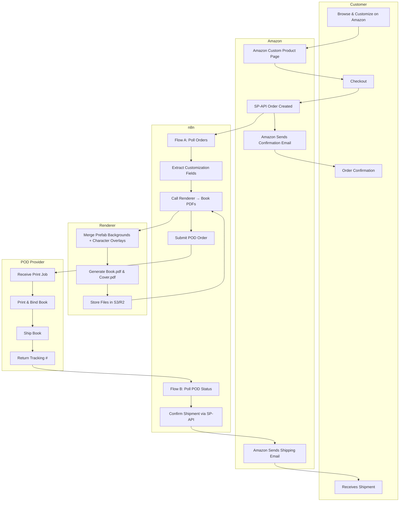

# Swimlane Diagram: Customer Experience & Order Flow (MVP)

This swimlane view shows how the main actors (Customer, Amazon, n8n, Renderer, POD) interact across the lifecycle of an order.

---

---

## Notes
- **Customer Lane:** Discovery, customization, checkout, confirmation, delivery.
- **Amazon Lane:** Captures customization, triggers SP‑API events, sends official comms.
- **n8n Lane:** Orchestrates intake (Flow A), generation, POD submission, and tracking (Flow B).
- **Renderer Lane:** Combines prefab assets and personalization, outputs print‑ready PDFs.
- **POD Lane:** Prints, ships, and returns tracking to feed back into Amazon.

---

✅ This diagram can be used both for UX discussions and as an engineering reference for implementing the MVP system.

