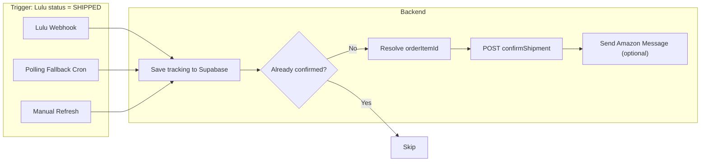

# Amazon Shipment Confirmation & Tracking — Implementation Plan

> **Last reviewed:** 2026-02-18 — Corrected against live SP-API docs, verified against codebase

## Goal

When Lulu ships an order, automatically:
1. Extract tracking info (tracking number, carrier, tracking URL) from Lulu
2. Call Amazon SP-API `confirmShipment` to mark the order as Shipped in Seller Central
3. This gives the customer tracking in their Amazon account and releases payment

## Current state

### What we already have

- **Lulu webhook handler** (`back-end/src/app/api/webhooks/lulu/status/route.ts`):
  - Receives `SHIPPED` status from Lulu
  - Extracts tracking via `extractTrackingInfo()` — parses `line_items[].status.messages.tracking_id`, `tracking_urls`, `carrier_name`
  - Saves `tracking_number`, `tracking_url`, `carrier` to the `orders` table
  - Already sends an Amazon Messages API notification (`sendAmazonShippedMessage`) for Amazon orders — but this only sends a *message*, it does **not** update the order's shipment status in Seller Central

- **Manual refresh endpoint** (`back-end/src/app/api/admin/orders/[orderId]/refresh-lulu-status/route.ts`):
  - Calls `GET /print-jobs/{id}/status/` on Lulu API to fetch current status + tracking
  - Updates Supabase with tracking data
  - **⚠ Bug:** Still uses OLD tracking extraction pattern (`firstItem.tracking_id`, `firstItem.carrier`) — does NOT look into `messages` / `status.messages` where Lulu nests tracking. Must be fixed as part of this work.

- **Amazon SP-API auth** (`back-end/src/lib/notifications/amazon-message-center.ts`):
  - Full LWA (Login With Amazon) OAuth token flow with caching
  - AWS Signature V4 signing for SP-API calls via `callSellingPartnerApi()`
  - Config: `AMZ_APP_CLIENT_ID`, `AMZ_APP_CLIENT_SECRET`, `AMZ_REFRESH_TOKEN`, `AMZ_SELLER_ID`, `AMZ_MARKETPLACE_ID`, `AWS_ACCESS_KEY_ID`, `AWS_SECRET_ACCESS_KEY`, `AWS_REGION`
  - All reusable for the Orders API `confirmShipment` call
  - **Currently not exported:** `getAccessToken()`, `callSellingPartnerApi()`, `getSignatureKey()` are private to the module

- **Sibling order handling** (`getAmazonOrderIdForMessaging()` — exported):
  - Resolves synthetic sibling order IDs (e.g. `114-xxx-item-152767221929961`) to parent Amazon order ID
  - Reusable for `confirmShipment` which needs the parent order ID

### What's missing

1. **No `confirmShipment` API call** — we never tell Amazon the order has shipped
2. **Carrier code mapping** — Lulu returns carrier names like `"USPS"`, `"UPS"`, etc.; Amazon expects specific `carrierCode` values
3. **No polling fallback** — if the Lulu webhook doesn't fire, tracking is never picked up automatically (only manual refresh works)
4. **`orderItemId` not reliably available** — `confirmShipment` requires it; only CSV-imported orders store it in `product_info.line_items[0].order_item_id`. API-ingested orders may not have it.
5. **No idempotency check** — if webhook + polling both fire, we'd call `confirmShipment` twice
6. **Manual refresh tracking extraction is stale** — doesn't use the fixed nested `messages` path

### Known issue: Lulu webhook reliability (#24)

The Lulu webhook has been unreliable. Root causes were identified and fixed (status parsed as object, tracking nested in wrong location, `shipped_at` gated). These fixes are deployed but not yet confirmed working end-to-end. If the webhook still doesn't fire reliably, the polling fallback (step 6 below) becomes critical.

---

## Architecture



---

## Implementation steps

### Step 1: SP-API permissions check (manual, pre-req)

The `confirmShipment` endpoint requires the **Inventory and Order Tracking** role.

Verify in your SP-API Developer Central app that:
- The app has the **Inventory and Order Tracking** role selected on the app registration page, AND
- The role is assigned to your developer profile

Alternatively, if you already have the **Direct-to-Consumer Delivery (Restricted)** role approved, that also grants access.

**This is the only external dependency that could block implementation.** If missing, request it in Amazon Developer Console — approval can take a few days.

### Step 2: Extract shared Amazon SP-API auth

**File**: `back-end/src/lib/amazon-sp-api.ts` (new file)

Move these from `amazon-message-center.ts` into a shared module:
- `getAmazonMessagingConfig()` → split into `getAmazonSpApiConfig()` (auth-only fields) + keep extended messaging config that adds `customerSiteUrl` and `autoApprovalHours`
- `getAccessToken()` + `accessTokenCache`
- `callSellingPartnerApi()` (generic SP-API caller with SigV4 signing)
- `getSignatureKey()` (helper)
- `getAmazonOrderIdForMessaging()` → rename to `resolveAmazonOrderId()`

**Config split:**
```typescript
// Base config — enough for any SP-API call
interface AmazonSpApiConfig {
  lwaClientId: string;
  lwaClientSecret: string;
  lwaRefreshToken: string;
  sellerId: string;
  marketplaceId: string;
  spRegion: string;
  awsAccessKeyId: string;
  awsSecretAccessKey: string;
  awsRegion: string;
}

// Extended for messaging-specific features
interface AmazonMessagingConfig extends AmazonSpApiConfig {
  customerSiteUrl: string;
  autoApprovalHours: number;
}
```

Then both `amazon-message-center.ts` and `amazon-shipment.ts` import from `amazon-sp-api.ts`.

### Step 3: Create `confirmAmazonShipment()` function

**File**: `back-end/src/lib/notifications/amazon-shipment.ts` (new file)

**Pseudocode**:
```
function confirmAmazonShipment({ amazonOrderId, orderItemId, trackingNumber, carrier, trackingUrl }):
  1. Resolve parent Amazon order ID (reuse resolveAmazonOrderId)
  2. If orderItemId is missing, call getOrderItems API to retrieve it (see Step 3b)
  3. If still no orderItemId, return { success: false, error: 'Missing orderItemId' }
  4. Map carrier name to Amazon carrierCode (see carrier mapping below)
  5. Get LWA access token (reuse getAccessToken from amazon-sp-api)
  6. POST via callSellingPartnerApi to:
       /orders/v0/orders/{orderId}/shipmentConfirmation
     Body: {
       marketplaceId: AMZ_MARKETPLACE_ID,
       codCollectionMethod: "",
       packageDetail: {
         packageReferenceId: "1",
         carrierCode: mappedCarrier,
         carrierName: mappedCarrier,
         shippingMethod: "SHIPPING",
         trackingNumber: trackingNumber,
         shipDate: new Date().toISOString(),
         orderItems: [{ orderItemId, quantity: 1 }]
       }
     }
  7. Return { success, error, amazonResponse }
```

> **Critical:** The endpoint path is `/orders/v0/orders/{orderId}/shipmentConfirmation` (NOT `/shipment`).
> `codCollectionMethod` is required by the API schema but can be empty string for non-COD orders.
> `packageReferenceId` must be a positive numeric string (e.g. `"1"`), not a prefixed ID.

**Carrier mapping** (Lulu → Amazon):
| Lulu carrier_name | Amazon carrierCode | Amazon carrierName |
|---|---|---|
| `USPS` | `USPS` | `USPS` |
| `UPS` | `UPS` | `UPS` |
| `FedEx`, `FEDEX` | `FedEx` | `FedEx` |
| `DHL` | `DHL` | `DHL` |
| Unknown/other | `OTHER` | (original Lulu carrier_name) |

### Step 3b: Resolve `orderItemId` when missing

**Problem:** Only CSV-imported orders have `product_info.line_items[0].order_item_id`. API-ingested orders (via `processAmazonOrders` cron) store `product_info` as `orderData.items || orderData.lineItems || orderItems` which may not include it.

**Solution — two-tier lookup:**

```typescript
async function resolveOrderItemId(order: any, config: AmazonSpApiConfig): Promise<string | null> {
  // Tier 1: Check local product_info
  const pi = typeof order.product_info === 'string'
    ? JSON.parse(order.product_info) : order.product_info;
  const localId = pi?.line_items?.[0]?.order_item_id
    ?? pi?._order_item_id
    ?? pi?.order_item_id
    ?? (Array.isArray(pi) ? pi[0]?.order_item_id : null);
  if (localId) return String(localId);

  // Tier 2: Call Amazon SP-API getOrderItems
  const parentOrderId = resolveAmazonOrderId(order);
  if (!parentOrderId) return null;
  try {
    const accessToken = await getAccessToken(config);
    const response = await callSellingPartnerApi({
      method: 'GET',
      path: `/orders/v0/orders/${parentOrderId}/orderItems`,
      accessToken,
      config,
      query: { MarketplaceIds: config.marketplaceId }
    });
    const items = response?.payload?.OrderItems ?? response?.OrderItems ?? [];
    // Return first item's OrderItemId (we only sell 1 SKU per order)
    return items[0]?.OrderItemId ?? null;
  } catch (err) {
    console.warn('[confirmShipment] Failed to fetch orderItems from SP-API:', err);
    return null;
  }
}
```

### Step 4: Wire `confirmAmazonShipment` into the Lulu webhook handler

**File**: `back-end/src/app/api/webhooks/lulu/status/route.ts`

In the existing `if (statusName === 'SHIPPED')` block (line ~261), **before** the Amazon Messages call:

```typescript
// Confirm shipment in Seller Central (updates order status + gives customer tracking)
if (platform !== 'd2c' && amazonOrderId) {
  // Idempotency: skip if already confirmed
  const { data: existingConfirm } = await supabase
    .from('notification_logs')
    .select('id')
    .eq('order_id', String(orderIdentifier))
    .eq('notification_type', 'amazon_confirm_shipment')
    .eq('status', 'sent')
    .maybeSingle();

  if (existingConfirm) {
    console.log(`[LULU WEBHOOK] Shipment already confirmed for ${orderIdentifier}, skipping`);
  } else {
    try {
      const { confirmAmazonShipment } = await import('@/lib/notifications/amazon-shipment');
      const result = await confirmAmazonShipment({
        amazonOrderId: String(amazonOrderId),
        order,
        trackingNumber: shippingTrackingNumber ?? undefined,
        carrier: updateData.carrier ?? undefined,
        trackingUrl: shippingTrackingUrl ?? undefined,
      });
      if (result.success) {
        console.log(`[LULU WEBHOOK] Amazon shipment confirmed for ${orderIdentifier}`);
      } else {
        console.warn(`[LULU WEBHOOK] Amazon confirmShipment failed for ${orderIdentifier}:`, result.error);
      }
      await supabase.from('notification_logs').insert({
        order_id: String(orderIdentifier),
        notification_type: 'amazon_confirm_shipment',
        status: result.success ? 'sent' : 'failed',
        recipient: String(amazonOrderId),
        error_message: result.error ?? null,
        sent_at: result.success ? new Date().toISOString() : null,
      });
    } catch (err) {
      console.warn('[LULU WEBHOOK] confirmShipment error:', err);
    }
  }
}
```

**Key change from original plan:** Pass the full `order` object instead of `orderItemId` — the `confirmAmazonShipment` function handles retrieval internally (including the SP-API fallback).

### Step 5: Fix manual refresh tracking extraction + add confirmShipment

**File**: `back-end/src/app/api/admin/orders/[orderId]/refresh-lulu-status/route.ts`

**Bug fix (lines 181-193):** The tracking extraction still uses the OLD pattern. Replace with the same nested `messages` lookup used in the webhook handler:

```typescript
// Current (broken):
trackingNumber = firstItem.tracking_id || firstItem.trackingId || null;
trackingUrl = Array.isArray(firstItem.tracking_urls) ? ...
carrier = firstItem.carrier || null;

// Fixed (matches webhook handler):
const msgs = firstItem.messages || firstItem.status?.messages || {};
const trackingUrls = msgs.tracking_urls || firstItem.tracking_urls;
trackingNumber = msgs.tracking_id || firstItem.tracking_id || firstItem.trackingId || null;
trackingUrl = Array.isArray(trackingUrls) ? trackingUrls[0] || null
  : firstItem.tracking_url || firstItem.trackingUrl || null;
carrier = msgs.carrier_name || firstItem.carrier_name || firstItem.carrier || null;
```

**Also add:** After updating Supabase, trigger `confirmAmazonShipment` if the status is SHIPPED/DELIVERED, same as the webhook handler (with the same idempotency check).

### Step 6: Remove or keep the Amazon Messages notification

Since `confirmShipment` already triggers Amazon's built-in "Your order has shipped" email to the customer (with tracking), the separate `sendAmazonShippedMessage` call is **redundant** for the shipping notification use case.

**Options**:
- **Remove it** — simplest, avoids double-messaging the customer
- **Keep it as a branded "your book is on its way!" message** — adds a personal touch beyond Amazon's generic template

**Recommendation**: Remove it initially to avoid confusion. Add it back later if you want a branded message in addition to Amazon's automatic one.

### Step 7: Add polling fallback for Lulu tracking (if webhook unreliable)

**File**: `back-end/src/app/api/cron/router/route.ts`

**Concern:** The cron router is already heavy (Amazon orders, preview reminders, lifecycle, W0 cleanup, capacity check, routing). Adding Lulu API calls could push it past Vercel's timeout.

**Recommended approach:** Add as a lightweight step with a strict time budget (max 10s, max 3 orders per run):

```
1. Query orders WHERE lulu_job_id IS NOT NULL
   AND lulu_status IN ('IN_PRODUCTION', 'SHIPPED')
   AND shipped_at IS NULL
   AND tracking_number IS NULL
   AND platform != 'd2c'
2. LIMIT 3 (strict cap to stay within cron timeout)
3. For each, call Lulu GET /print-jobs/{lulu_job_id}/status/
4. If status is SHIPPED and tracking is present:
   a. Update Supabase with tracking data (use fixed extraction)
   b. Call confirmAmazonShipment() (with idempotency check)
5. Time-guard: if cumulative time > 10s, break early
```

If cron timeout becomes an issue, this step can be moved to a dedicated `/api/cron/lulu-poll` endpoint with its own Vercel cron schedule.

---

## Files to create / modify

| Action | File | Notes |
|--------|------|-------|
| **Create** | `back-end/src/lib/amazon-sp-api.ts` | Shared auth, signing, config, `resolveAmazonOrderId()` |
| **Create** | `back-end/src/lib/notifications/amazon-shipment.ts` | `confirmAmazonShipment()` + `resolveOrderItemId()` |
| **Modify** | `back-end/src/lib/notifications/amazon-message-center.ts` | Import auth from shared module, remove moved functions |
| **Modify** | `back-end/src/app/api/webhooks/lulu/status/route.ts` | Add `confirmShipment` call with idempotency check |
| **Modify** | `back-end/src/app/api/admin/orders/[orderId]/refresh-lulu-status/route.ts` | Fix tracking extraction + add `confirmShipment` |
| **Modify** | `back-end/src/app/api/cron/router/route.ts` | Add Lulu polling fallback (step 7) |

---

## Implementation order

| Step | Depends on | Delivers |
|------|-----------|----------|
| 1. SP-API permissions check | — | Confirm we can call `confirmShipment` |
| 2. Extract shared SP-API auth | — | `amazon-sp-api.ts` with reusable auth |
| 3. Create `confirmAmazonShipment()` | 2 | Working shipment confirmation function |
| 3b. `resolveOrderItemId()` with SP-API fallback | 2 | Reliable orderItemId for all order types |
| 4. Wire into Lulu webhook | 3 | Auto-confirm on SHIPPED webhook |
| 5. Fix manual refresh + wire confirmShipment | 3 | Bug fix + manual trigger for confirm |
| 6. Remove redundant Messages call | 4 | Clean up double-messaging |
| 7. Add polling fallback | 3 | Cron-based tracking pickup |

Recommended sequence: **1 → 2 → 3/3b → 4 → 5 → 6 → 7**. Steps 4-7 can be done in one pass after 3 is tested.

---

## Acceptance criteria

- After Lulu ships an order, the Amazon order shows "Shipped" status with tracking number in Seller Central within the next webhook/cron cycle
- Customer receives Amazon's automatic "Your order has shipped" email with tracking link
- `notification_logs` table has an `amazon_confirm_shipment` entry for each attempt
- Orders table has `tracking_number`, `tracking_url`, `carrier` populated
- If Lulu webhook doesn't fire, the polling fallback picks up tracking within the cron interval
- No double-confirmation: idempotent via `notification_logs` check before calling SP-API
- Manual refresh also triggers `confirmShipment` (and uses correct nested tracking extraction)
- `orderItemId` resolved from local DB or SP-API `getOrderItems` fallback

---

## Risk register

| Risk | Impact | Mitigation |
|------|--------|------------|
| SP-API app missing "Inventory and Order Tracking" role | Blocks all implementation | Check FIRST (Step 1), request early |
| `orderItemId` unavailable and `getOrderItems` call fails | Cannot confirm shipment | Log warning, skip gracefully, manual CSV import as fallback |
| `getOrderItems` requires RDT for PII fields | Minor: extra API call | We only need `OrderItemId` (non-PII) — no RDT required. Verified. |
| Cron router timeout with Lulu polling added | Missed routing cycles | Time-guard (10s cap), fallback to separate cron |
| Amazon returns error on duplicate `confirmShipment` | No impact | Re-calling with same `packageReferenceId` edits (not errors). Idempotency check still useful to avoid unnecessary calls. |
| Lulu webhook still not firing after #24 fixes | No auto-confirm | Polling fallback (Step 7) covers this |

---

## API documentation verification (2026-02-18)

### Amazon SP-API — confirmShipment ([docs](https://developer-docs.amazon.com/sp-api/docs/confirm-the-shipment-status))

| Detail | Verified value |
|--------|---------------|
| Endpoint path | `POST /orders/v0/orders/{orderId}/shipmentConfirmation` |
| Required role | **Inventory and Order Tracking** (or Direct-to-Consumer Delivery Restricted) |
| Required body fields | `marketplaceId`, `codCollectionMethod` (empty string OK for non-COD), `packageDetail` |
| `packageDetail` fields | `packageReferenceId` (positive numeric string), `carrierCode`, `carrierName`, `shippingMethod`, `trackingNumber`, `shipDate` (ISO 8601), `orderItems[]` |
| `orderItems[]` | `orderItemId` (string), `quantity` (integer) |
| Optional fields | `shipFromSupplySourceId` — omit (we don't use Supply Sources) |
| Idempotency | Re-calling with same `packageReferenceId` **edits** the shipment (not an error) — safe to retry |
| Ship+ orders | Return `400` — not applicable (we're seller-fulfilled) |

### Amazon SP-API — getOrderItems ([role source](https://spapi.cyou/en/use-other/inventory-and-order-tracking-role.html))

| Detail | Verified value |
|--------|---------------|
| Endpoint path | `GET /orders/v0/orders/{orderId}/orderItems` |
| Required role | **Inventory and Order Tracking** (same role as confirmShipment — no extra role needed) |
| RDT required? | Only for `buyerInfo` PII fields; `OrderItemId` is non-PII and returned without RDT |

### Lulu API — Webhook payload ([docs](https://api.lulu.com/docs/))

| Detail | Verified value |
|--------|---------------|
| Webhook topic | `PRINT_JOB_STATUS_CHANGED` |
| Payload wrapper | `{ data: <print job detail>, topic: "PRINT_JOB_STATUS_CHANGED" }` |
| Payload format | Same as `GET /print-jobs/{id}` (full print job detail, NOT the status endpoint) |
| Top-level `status` | **Object**: `{ name: "SHIPPED", changed: "...", message: "..." }` — not a string |
| Line items key | `line_items[]` (NOT `line_item_statuses[]` — that's only the status endpoint) |
| Tracking location | `line_items[].status.messages.tracking_id`, `.tracking_urls[]`, `.carrier_name` |

### Lulu API — Status endpoint (`GET /print-jobs/{id}/status/`)

| Detail | Verified value |
|--------|---------------|
| Top-level `name` | String: `"SHIPPED"` (not an object — different from webhook!) |
| Line items key | `line_item_statuses[]` |
| Tracking location | `line_item_statuses[].messages.tracking_id`, `.tracking_urls[]`, `.carrier_name` |
| Used by | Manual refresh endpoint (`refresh-lulu-status/route.ts`) |

> **Key difference:** The webhook sends `line_items[].status.messages.*` while the status endpoint sends `line_item_statuses[].messages.*`. Our webhook handler's fallback chain (`firstItem.messages || firstItem.status?.messages`) handles both correctly. The manual refresh endpoint needs the same pattern applied.

---

## Context for the new chat

Key files to read before implementing:
- `back-end/src/lib/notifications/amazon-message-center.ts` — has all the SP-API auth, signing, and token management to extract into shared module
- `back-end/src/app/api/webhooks/lulu/status/route.ts` — the SHIPPED handler where confirmShipment will be wired
- `back-end/src/app/api/admin/orders/[orderId]/refresh-lulu-status/route.ts` — manual refresh path (needs tracking extraction bug fix)
- `back-end/src/app/api/cron/router/route.ts` — cron job for polling fallback (already heavy)
- `docs/_ongoing-issues-list/_needs-review/24-lulu-webhook-not-updating-order-status.md` — context on webhook reliability
- `docs/_ongoing-issues-list/_needs-review/25-amazon-shipping-notifications-not-sent.md` — context on notification issues
